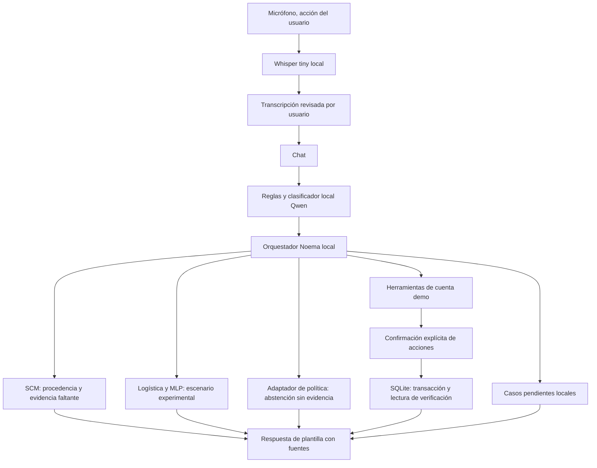

# Noema local: arquitectura, límites y plan de integración

1 de octubre de 2026 · Prototipo local pendiente de revisión. No se publica.

## Qué se construyó

Frontend de conversación con controles de voz y panel de evidencia; API FastAPI;
un orquestador local (`prototype/core.py`); base SQLite de simulación; integración
con los artefactos comerciales existentes, SCM y el adaptador de política de Eduardo.
No se encontró un Noema Core ejecutable previo separado del SCM y de los módulos
de política/serving; este orquestador es una primera implementación local, no una
sustitución certificada del sistema completo descrito en los documentos.

## Decisiones y razones

1. **Revisar evidencia antes de ampliar complejidad.** Las MLP comparten el objetivo
   comercial con la logística. El nuevo clasificador de escalación no mostró señal
   suficiente; no se le concede autoridad sobre atención humana.
2. **Inferencia sin servicios pagos.** Se reutilizó Qwen2.5 1.5B disponible en Ollama
   en este equipo. `noema-bank-local` es un modelo derivado por configuración; los
   pesos no se modificaron. Llama sigue siendo una alternativa, pero no se necesita
   descargar otra familia para demostrar el flujo. Hardware, energía y almacenamiento
   siguen siendo recursos necesarios; «local» no significa costo operativo nulo.
3. **LLM con autoridad limitada.** Solo devuelve un `intent` de una enumeración.
   Sus números y respuestas libres nunca se muestran ni ejecutan. Las reglas
   reconocen primero solicitudes comunes, fraude y petición explícita de humano.
   Un error del LLM puede enrutar mal: no se confunde JSON válido con intención
   correcta. Una prueba inicial confundió saldo y movimientos; se aclararon las
   definiciones y la repetición pasó. Esto no constituye una evaluación amplia de NLU.
4. **Separar hechos, inferencias y simulación.** El saldo sale de SQLite; el catálogo,
   del YAML versionado; la probabilidad comercial, de artefactos locales. La interfaz
   muestra fuentes y evidencia. El cliente demo jamás se vincula automáticamente a
   alguno de los clientes del dataset.
5. **SCM sin ampliar su contrato.** Se instancia por petición y conserva sus cuatro
   métodos públicos. Registra identidad demo no verificada, intención inferida,
   resultados de modelo y respuesta renderizada con procedencia. La elegibilidad
   consulta evidencia faltante y el adaptador devuelve abstención con entradas nulas.
   No se alimenta al motor con identidad afirmada por texto. Las demás intenciones
   aún no están en `REQUIRED_SLOTS`: la SCM marca `intent` faltante y `INCOMPLETE`.
   Esto es una limitación explícita, no evidencia de autorización. Falta extender
   el esquema y mantener memoria semántica por conversación con invalidación/versiones.
6. **Escrituras revisables e idempotentes.** La preparación no cambia el saldo.
   Confirmar una acción exige sesión y CSRF; la transacción vuelve a leer el estado
   y persiste un recibo. Reintentar devuelve ese recibo. Una acción nueva invalida
   borradores anteriores. El único destino soportado es «ahorro demo», expuesto en
   la confirmación: no hay transferencias a beneficiarios reales.
7. **Voz con revisión previa.** MediaRecorder manda audio al backend del mismo equipo;
   faster-whisper usa pesos locales. El usuario revisa texto antes del chat y confirma
   operaciones por separado. No se usa `SpeechRecognition` remoto del navegador.
   Lectura opcional con voces `localService`; si no hay voz española, queda texto.

## Contratos HTTP

| Endpoint | Propósito | Control |
|---|---|---|
| POST `/api/session` | Nueva cuenta ficticia aislada | Origen y cabecera local |
| POST `/api/chat` | Mensaje de hasta 2,000 caracteres | Cookie de sesión + CSRF |
| POST `/api/confirm` | Acción demo previamente preparada | Acción vinculada a sesión + CSRF |
| POST `/api/transcribe` | Audio ≤8 MiB, duración ≤35 s | Sesión + CSRF; revisión requerida |
| GET `/api/cases` | Casos de esa sesión | Sesión + CSRF |
| GET `/api/health` | Disponibilidad de pesos de voz y modo demo | No certifica calidad ni salud de Ollama |

Host y origen limitados a localhost/127.0.0.1; cookie HttpOnly/SameSite Strict,
expiración dos horas; política de contenidos sin CDN/scripts externos; consultas
SQLite parametrizadas y salida de UI con `textContent`. No se conservan grabaciones
ni mensajes originales. Persisten sesiones, operaciones simuladas y categorías de
casos en disco local. No hay todavía rate limiting, MFA, gestión de roles, cifrado de
base, retención automática ni auditoría inmutable. No exponer este servidor a Internet.

## Integración analítica real versus pendiente

La API carga la red de seis capas y la logística. Presenta una hipótesis fija:
Tarjeta Crédito, Email, tres exposiciones previas, corte 2025-12-31. Resume número
 e importe de transferencias demo por separado; esos movimientos **no** son entradas
del modelo comercial actual. Los artefactos reales se ejecutan, pero la consulta no
es un perfil individual real. No se promete que la probabilidad mida deseo,
solvencia ni nuevo producto para un cliente.

El adaptador existente `ml/serving/client_analysis.py` permite análisis autorizado
por cliente con datos locales y `VerifiedPolicyInput`. Conectarlo al servicio exige
un proveedor de identidad confiable que vincule sesión y customer_id, autorización
por recurso y snapshots disponibles al corte. El texto del usuario nunca debe
construir ese objeto verificado. La política se ejecutará tras validar obligaciones,
moneda, fechas y procedencia, usando el YAML vigente, sin duplicar sus umbrales.

## Capacidades y siguiente fase

| Capacidad | Ahora | Necesario antes de uso real |
|---|---|---|
| Saldo/movimientos | SQLite demo | API bancaria autenticada y frescura |
| Transferencias/bloqueo | Simulados con confirmación | Beneficiarios, límites, MFA, ledger bancario y conciliación |
| Productos | Catálogo versionado del proyecto | Catálogo vigente, jurisdicción y aprobación de contenido |
| Cupos | Abstención por falta de identidad y hechos | Identidad, obligaciones completas y política autorizada |
| Escalamiento | Casos guardados localmente | Mesa de ayuda, propietario, SLA y notificación/acuse real |
| Voz | ASR local y revisión; TTS local opcional | Acentos/ruido, accesibilidad, pruebas en dispositivos |
| Otras gestiones bancarias | Fuera de alcance | Contratos de herramientas, permisos y pruebas por cada operación |

Una cuenta bancaria completa no se obtiene entrenando un LLM: requiere integraciones
transaccionales y autorizaciones específicas. Cancelaciones, disputas, cambios de
datos personales, pagos y aperturas no están implementados en esta entrega.

## Plan de especialización del LLM

Primero construir un corpus revisado y desidentificado de solicitudes en español,
portugués e inglés. Cada ejemplo debe incluir intención correcta, datos que faltan,
fuente documental versionada, herramientas permitidas, respuesta esperada y motivo
de escalamiento. Guardar tiempos de disponibilidad y consentimiento/origen del dato.
No usar filas del Excel como conversaciones ni entrenar identidad o secretos.

Agregar recuperación local de documentación aprobada con citas, vigencia y abstención
si no hay soporte; **RAG todavía no implementado**. Evaluar el modelo base antes de
considerar LoRA: dividir por cliente/documento y tiempo, reservar test no tocado,
comparar tasas de hechos sin soporte, selección de herramientas, omisiones de
escalamiento crítico, latencia y memoria. Solo ajustar pesos si mejora sobre el
baseline en un conjunto externo sin degradar seguridad; los permisos y cálculos
siguen fuera del LLM. Hoy no hay un corpus etiquetado suficiente ni evidencia para
presentar el modelo como experto bancario validado.

## Verificación de esta entrega

- Suite del proyecto: 175 pruebas pasan tras agregar 13 casos del prototipo.
- Ruff de archivos Python nuevos: limpio.
- Casos cubiertos: sesión/CSRF/origen, separación de clientes, expiración,
  idempotencia, saldo insuficiente, importes negativos/ambiguos, tarjeta, caso humano,
  abstención crediticia y LLM no disponible.
- Petición real al Ollama local: pregunta indirecta de saldo en inglés se clasificó
  como `balance`; números obtenidos de la herramienta.
- Audio sintético local «What is my balance?» → transcripción exacta y HTTP 200.
  No se activó el micrófono del usuario; falta ensayo acústico real.
- No se afirma precisión multilingüe, ausencia de alucinaciones o autorización de
  producción a partir de estas pruebas funcionales.

## Fuentes de implementación

- [Ollama, API de chat](https://docs.ollama.com/api/chat): inferencia local y salida estructurada.
- [Qwen2.5 en Ollama](https://ollama.com/library/qwen2.5): familia seleccionada; revisar licencia de la variante antes de distribuir.
- [faster-whisper](https://github.com/SYSTRAN/faster-whisper): inferencia local de voz.
- [MDN SpeechRecognition](https://developer.mozilla.org/en-US/docs/Web/API/SpeechRecognition): diferencias entre reconocimiento remoto y local.
- Marco metodológico: [Data Science Cheatsheet de Aaron Wang](https://github.com/aaronwangy/Data-Science-Cheatsheet); separar hipótesis, baseline, validación y diagnóstico.
